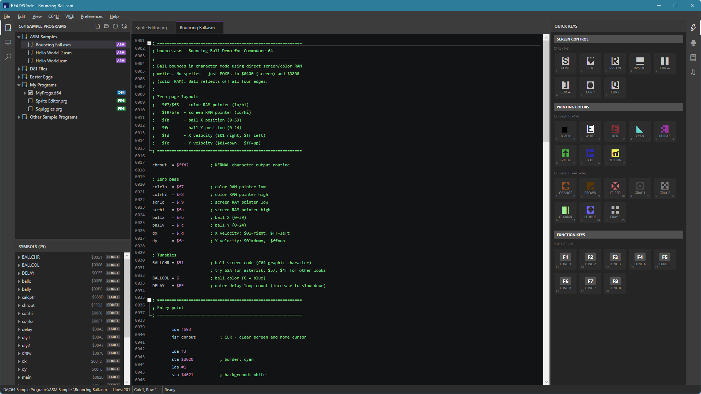
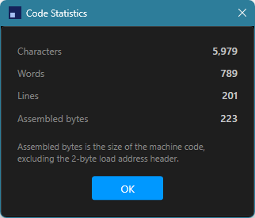

# The Assembly Editor

READYCode also supports writing 6502 assembly language directly, for programs that need more speed or control than BASIC allows. This page covers the assembly-specific editing features and what the built-in assembler produces.

## Creating an assembly file

Use **File > New > Assembly File** (Ctrl+Alt+N) to start a new `.asm` file. Assembly files are edited as plain text, unlike BASIC's tokenized `.prg` format, so the usual text-editing conventions apply: case matters, and there is no automatic line numbering.

## Auto-indent

When enabled (**Preferences > Settings... > Assembly > Formatting**), pressing Enter cleans up the line you just finished, then carries that forward to the new line:

- A bare mnemonic line (not preceded by a label), even one typed at column 1 in the wrong case like `lda #25`, is re-indented to the Mnemonic indent column with its mnemonic upper-cased (e.g. becoming `LDA #25` at the configured indent). The new line is then indented to match, so a routine's instructions line up automatically as you type.
- Any line with an inline `;` comment - a mnemonic line, a label, a directive, whatever precedes it - has that comment realigned to the Comment alignment column.

A whole-line comment (nothing before the `;`), a label-only line, or a blank line is left untouched.

**Edit > Format Code** (Ctrl+K, Ctrl+F) applies these same two rules to the whole file at once, rather than only as you type - handy for cleaning up a file (such as one pasted in from elsewhere) that wasn't written to the configured indent/alignment columns to begin with. It also moves whole-line comments and an origin directive (`.org` or `* =`) to column 1, regardless of how they were indented in source. It replaces Edit menu's Minify/Prettify/Renumber Code entries (BASIC-only commands) while an assembly file is active.

## Syntax highlighting

Mnemonics, numeric literals, labels, and `;` comments are each highlighted separately, making the structure of a routine easy to follow.

## Supported instructions and directives

The built-in assembler supports the full standard 6502 instruction set, all 56 official mnemonics, with every legal addressing mode for each one: immediate, zero page (with X or Y indexing), absolute (with X or Y indexing), indirect, indexed indirect, indirect indexed, accumulator, relative, and implied. `ASL`, `LSR`, `ROL`, and `ROR` also accept being written with no operand at all (e.g. plain `ASL` rather than `ASL A`), a common convention in sources ported from other assemblers - it's treated as shorthand for the accumulator form.

A small set of directives is supported:

- `.org` (or `* = value`, an accepted alias for sources ported from other assemblers) sets the assembly origin (the memory address the code will load at). If used, it must be the first thing in the file.
- `.byte` / `.text` embeds literal bytes, including quoted strings.
- `.word` embeds 16-bit values, either literal or symbolic.
- `NAME = value` (or `.label NAME = value`, an accepted alias for sources ported from KickAssembler) declares a named constant.
- `.encoding "mode"` sets how quoted strings in `.byte` / `.text` are converted to bytes, from that point in the file onward until the next `.encoding` directive. Supported modes: `ascii` (the default - plain ASCII codes), `petscii_upper` / `petscii_mixed` (PETSCII codes, matching the C64's uppercase-only or upper/lowercase charset), and `screencode_upper` / `screencode_mixed` (the equivalent screen codes, for POKEing text directly into screen memory).

There is no macro support.

## Labels and constants

Labels are declared with a trailing colon (`label:`) and are case-sensitive, along with constants. Symbol expressions like `msgptr+1` are supported when referencing a label or constant with an offset. Assembly happens in two passes, so labels can be referenced before they are declared later in the file.

A constant's value is usually a plain number, and like labels, those can be declared anywhere in the file regardless of where they're used. A constant's value can also be `*` (the current address at that point in the file) or another label/constant, optionally with an offset (e.g. `data+15`, or `size = * - start` to compute a data block's byte count) - but a constant defined this way can only reference a symbol that appears *earlier* in the file, since its value depends on where assembly has reached rather than being a fixed number.

`*` can also be used as an ordinary operand, standing for the address of the instruction or `.word` entry it appears on - `JMP *` (jump to itself) is a common way to halt.

## What assembling produces

How a program is packaged depends on whether the source uses `.org`, and on the **Output** setting in **Preferences > Settings... > Assembly > Assembler**:

- **Without `.org`**, and with Output set to **Auto** (the default): READYCode produces a complete, directly runnable `.prg`. It automatically prepends a tiny one-line BASIC loader stub (`10 SYS 2062`) ahead of your machine code, so the result can be loaded and run immediately without writing your own loader.
- **Without `.org`**, and with Output set to **Standalone**: READYCode writes a standard two-byte load-address header using the configured **Default origin address** instead, and does not add the BASIC stub.
- **With `.org`**: READYCode always writes a two-byte load-address header at that address and never adds the BASIC stub, regardless of the Output setting - an explicit `.org` always wins.

Standalone/raw output is the typical choice for code that needs to load at a specific address, such as sprite or character data, or a program meant to be called from elsewhere rather than run directly.

## Diagnostics

The editor runs the real assembler in the background as you type and reports any problem as a squiggle underline: duplicate labels or constants, undefined labels, invalid addressing modes, branches that are out of range, operand overflow, and malformed `.org` usage among them. Hover over a squiggle to see the specific error.

## The Symbols panel

Below the primary side bar, the Symbols panel lists every label and constant in the active assembly file, with occurrence counts. Click an occurrence to jump straight to it. This is the assembly-language counterpart to the Variables panel shown for BASIC files.

## Hover tooltips

Hovering over a mnemonic shows a short description and the addressing modes it supports. Hovering over a line flagged by a diagnostic shows the specific error instead.

## The ASM Mnemonics panel

A reference panel, available from the right activity bar, listing every supported mnemonic with a description, the assembly-language counterpart to the BASIC Keywords panel.

## Code folding

Runs of two or more consecutive full-line `;` comments can be collapsed to reduce clutter. Folding can be turned off in **Preferences > Settings... > Assembly > Code Analysis**.

## Code Statistics

**View > Code Statistics** opens a dialog showing character, word, and line counts for the active document, along with the assembled byte count.

---

[Back to Documentation Home](README.md)
