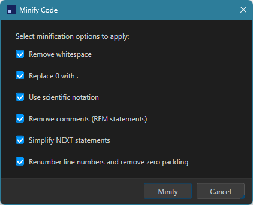
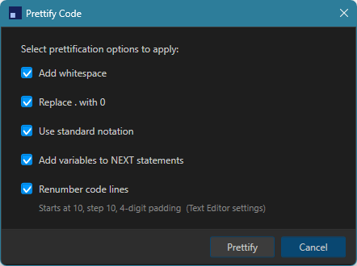

# Minify and Prettify

BASIC programs on a real C64 have limited memory, and every character in a program's source counts against it. READYCode includes two complementary tools for reshaping BASIC source: Minify, which shrinks it, and Prettify, which makes it easier to read. Both work only on BASIC files.

## Minify

**Minify Code** (Ctrl+M, or Edit menu) opens a dialog with several independent options, each of which can be turned on or off:

- **Remove whitespace** - strips spaces outside string literals and `DATA` statements.
- **Replace 0 with .** - shortens leading-zero decimals, so `0.5` becomes `.5`.
- **Use scientific notation** - rewrites long integers in `E` notation wherever that is actually shorter, for example `100000` becomes `1E5`.
- **Remove comments (REM statements)** - strips `REM` statements and trailing `: REM` comments. If a removed `REM` line was the target of a `GOTO` or `GOSUB`, the reference is automatically redirected to the next surviving line.
- **Simplify NEXT statements** - drops the variable name from `NEXT` statements, since it is optional in C64 BASIC.
- **Renumber line numbers and remove zero padding** - renumbers the program sequentially and fixes up every line-number reference to match.

Every pass is careful about context: string literals and `DATA` statement contents are never touched by whitespace removal, notation changes, or comment stripping, so literal data your program depends on cannot be corrupted.

READYCode can also minify automatically whenever you transfer or run a program on the C64 Ultimate, using its own copy of these same options, configured in **Preferences > Settings... > BASIC > Minify**. This lets you keep your working copy fully readable while still sending a compact version to the machine.

## Prettify

**Prettify Code** (Ctrl+Shift+M, or Edit menu) does the inverse: it takes compact or minified BASIC and reformats it for readability.

- **Add whitespace** - inserts spaces around keywords and operators consistently.
- **Replace . with 0** - expands a bare leading period, C64 BASIC's shorthand for a leading zero, back into `0.5` style.
- **Use standard notation** - expands `E` notation back into full decimal integers.
- **Add variables to NEXT statements** - restores the matching `FOR` loop variable on any bare `NEXT`.
- **Renumber code lines** - renumbers the program with a configurable starting line number, increment, and zero-padding width, shown live in the dialog as you adjust them.

## Choosing between them

Minify and Prettify are meant to be used at different points in your workflow: Prettify while you are actively writing and want your code easy to follow, and Minify when you are ready to fit a program into limited memory or simply prefer a compact style. Both are non-destructive in the sense that you can always run the other one afterward to reformat again, though some transformations (like comment removal) cannot be undone by Prettify since the removed text is simply gone.

---

[Back to Documentation Home](README.md)
