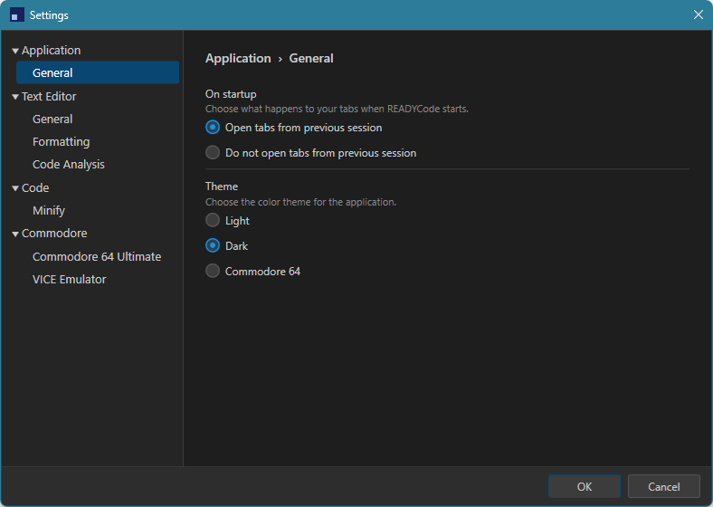

# Preferences

READYCode's settings live in one place: **Preferences > Settings...**, organized as a tree of categories on the left of the Settings window. This page walks through what each category controls.

## Application > General

- **Restore previous session** - whether previously open tabs (and which ones were in Hex Editor mode) are reopened automatically the next time you launch READYCode.
- **Theme** - Light, Dark, or a Commodore-64-palette theme, switchable at any time without restarting.

## Text Editor > General

- **Editor font size** - adjustable from 6 to 72, shared by the BASIC/Assembly editor, the Disassembler, and the Hex Editor.

## BASIC > Formatting

- **Line number zero-padding** - keeps line numbers a consistent width.
- **Auto-number lines** - automatically inserts the next line number when you press Enter, plus the increment to use.
- **Column guide** - a vertical guide marking a chosen column in BASIC tabs, useful for keeping lines within a target width (40 for the C64, 22 for the VIC-20).

## BASIC > Code Analysis

- **Linting** - toggles the inline diagnostics that flag duplicate line numbers, bad `GOTO`/`GOSUB` targets, unmatched `NEXT`, and unterminated strings.
- **Code folding** - toggles the ability to collapse `REM` blocks and `FOR`/`NEXT` loops in a BASIC tab.

## BASIC > Minify

- **Minify code when transferring to/running on the C64U** - automatically applies Minify's transformations to a copy of your program before sending it to the C64 Ultimate, leaving your working copy untouched. The same six options available in the [Minify dialog](minify-and-prettify.md) are configured here for this automatic pass.

## Assembly > Formatting

- **Mnemonic indent column** - column mnemonics (`LDA`, `STA`, `JMP`, etc.) and `.byte` lines are indented to, in the Disassembler's output and via Auto-indent below.
- **Comment alignment column** - column inline `;` comments are aligned to, in the Disassembler's output and via Auto-indent below.
- **Column guide** - a vertical guide marking a chosen column in assembly tabs, independent of BASIC's own column guide setting.
- **Auto-indent** - when enabled, pressing Enter normalizes the line you're leaving: a bare mnemonic line (not preceded by a label) is indented to the Mnemonic indent column and its mnemonic is upper-cased, and the new line is indented to match; any line with an inline `;` comment has that comment realigned to the Comment alignment column, regardless of whether it's a mnemonic, label, or directive line. A whole-line comment, a label-only line (e.g. `loop:`), or a blank line is left untouched.

## Assembly > Code Analysis

- **Code folding** - toggles the ability to collapse runs of consecutive full-line `;` comments in an assembly tab, independent of BASIC's own code folding setting.

## Assembly > Assembler

- **Output** - whether assembled code is packaged as a runnable program with an auto-generated BASIC loader stub ("Auto"), or as a standalone `.prg` with no loader ("Standalone"). Applies whenever a tab is transferred or run on the C64 Ultimate or VICE, and to the Code Statistics and Symbol Explorer's assembled-byte/address figures. An explicit `.org` directive in the source always wins over this setting.
- **Default origin address** - the memory address standalone output starts at (e.g. `$C000`), used when the source has no `.org` directive of its own.

## Commodore > Commodore 64 Ultimate

- **Show C64U Menu** - hides the C64U menu entirely if you do not use one.
- **C64U REST API base URL** - the address of your C64 Ultimate on your local network.

## Commodore > VICE Emulator

- **Show VICE Menu** - hides the VICE menu entirely if you do not use it.
- **Bring VICE to the foreground** - automatically switches to the VICE window whenever you load or run a program.
- **Emulator executable path** - the location of your VICE executable (for example `x64sc.exe`), with a Browse button to locate it.
- **Binary monitor host and port** - where READYCode connects to control VICE, defaulting to `127.0.0.1:6502`.

See [Transferring to Hardware and Emulators](c64-ultimate-and-vice.md) for what these two integrations actually do.

## Other things READYCode remembers

Beyond the settings above, READYCode also quietly remembers window position and size, panel widths and open/closed state, which reference panel tab was last active, the last folder used in Open/Save dialogs, and up to ten recently opened files, none of which require a Preferences entry of their own.

---

[Back to Documentation Home](README.md)
